# Restricting Control Panel Access via Group Policy (GPO)

A step-by-step walkthrough for restricting access to **Control Panel and PC Settings** for the HR department using **Active Directory Group Policy Management**. This was tested in a lab environment (`test.com` domain) by applying the restriction to the `HR` Organizational Unit and verifying the result on a test user account (`zeno`).

## Overview

In many organizations, end users in certain departments (like HR, due to the sensitivity of the data they handle) shouldn't be able to change system settings. This guide shows how to create a dedicated GPO, link it to the HR OU, and enable the **"Prohibit access to Control Panel and PC settings"** policy so it applies to every user under that OU.

## Environment

- Windows Server with Active Directory Domain Services (domain: `test.com`)
- Active Directory organized into OUs: `HR`, `IT`, `SALES`
- Test user: `zeno` (member of the `HR` OU)
- Client machine joined to the domain for testing

## Steps

### 1. Open Group Policy Management

From Server Manager, go to **Tools > Active Directory Sites and Services** to access the management tools, then open **Group Policy Management**.

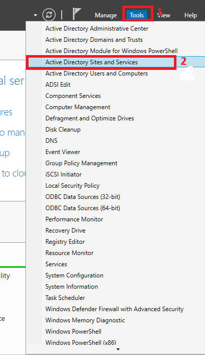

### 2. Locate the HR Organizational Unit

In the Group Policy Management console, expand the domain and find the **HR** OU, since this GPO will only apply to HR users and computers.

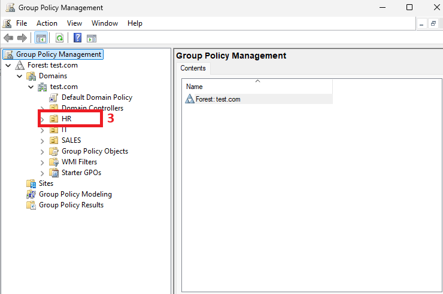

### 3. Create and link a new GPO to the HR OU

Right-click the **HR** OU and choose **Create a GPO in this domain, and Link it here…**

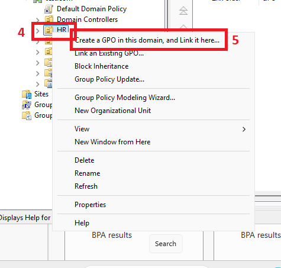

### 4. Name the GPO

Give the new GPO a descriptive name, in this case **"control panel restriction"**, then click **OK**.

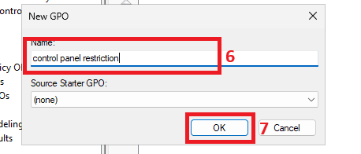

### 5. Edit the GPO

Right-click the newly created GPO and select **Edit…** to open the Group Policy Management Editor.

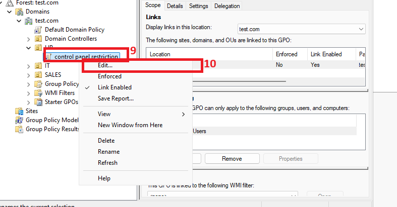

### 6. Navigate to Administrative Templates

Under **User Configuration > Policies**, expand **Administrative Templates**.

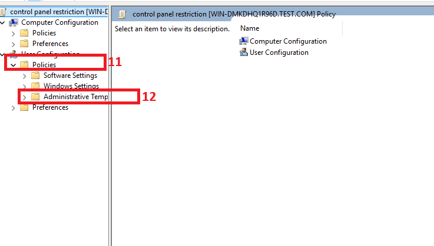

### 7. Open the Control Panel settings node

Inside Administrative Templates, click on **Control Panel** to see the available restriction settings.

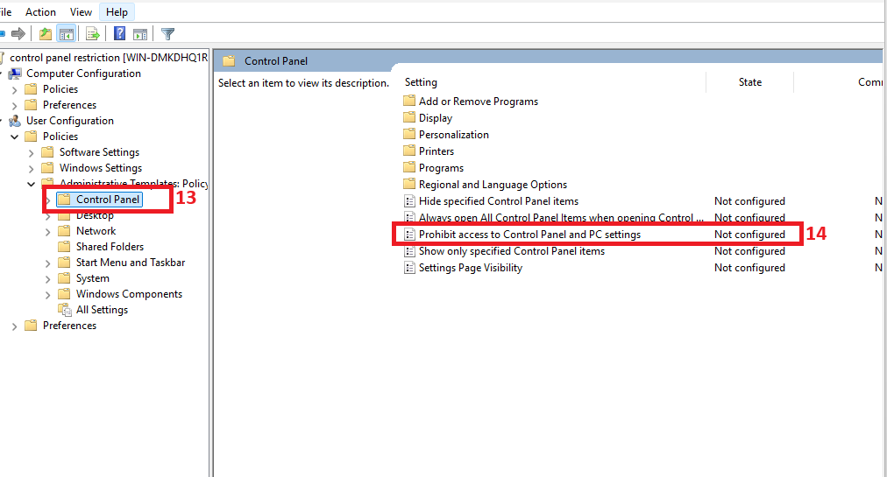

### 8. Enable the restriction

Double-click **Prohibit access to Control Panel and PC settings**, select **Enabled**, and click **OK**. This setting prevents `Control.exe` and `SystemSettings.exe` from starting, removing Control Panel and PC Settings from the Start screen, File Explorer, and other entry points.

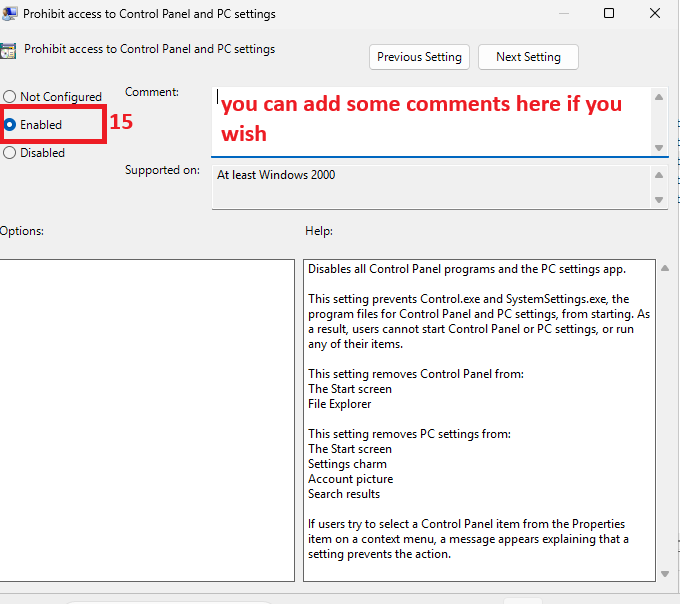

### 9. Identify the test user

Under the **HR** OU in Active Directory Users and Computers, there is a user account named **zeno**. This is the account used to confirm whether the policy applies correctly.

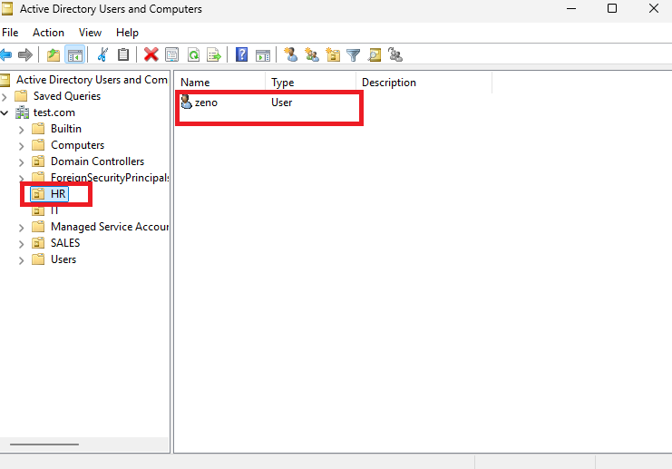

### 10. Log in as the test user

On the domain-joined client machine, log in as **zeno** to test the policy from the user's perspective.

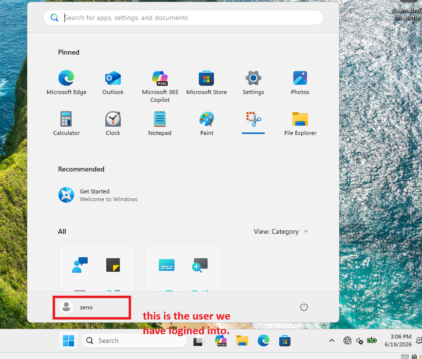

### 11. Confirm the restriction is working

Attempting to open Control Panel now returns a **Restrictions** dialog: *"This operation has been cancelled due to restrictions in effect on this computer. Please contact your system administrator."* This confirms the GPO is applied correctly.

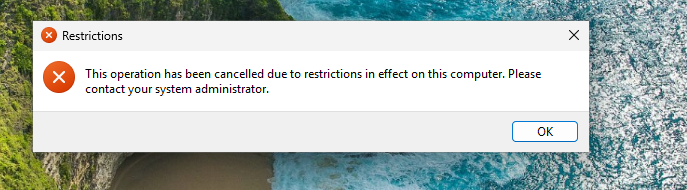

### 12. Force a Group Policy update (if needed)

If the policy hasn't taken effect yet (due to the default refresh interval), open Command Prompt and run:

```
gpupdate /force
```

This immediately pulls and applies the latest Computer and User policy settings instead of waiting for the next automatic refresh cycle.

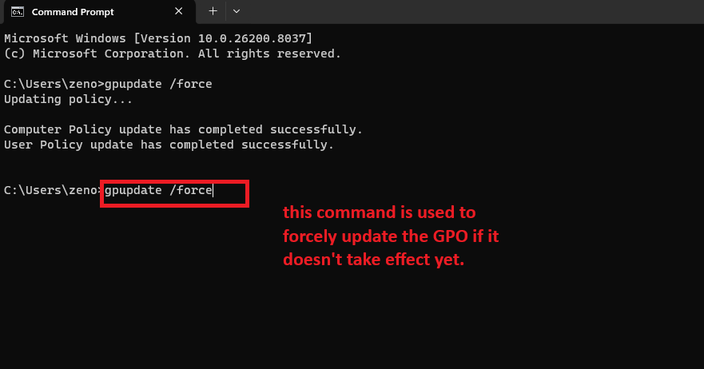

## Result

The `control panel restriction` GPO, linked to the **HR** OU, successfully blocks all users in that OU — including `zeno` — from accessing Control Panel and PC Settings.

## Notes

- This policy is a **User Configuration** setting, so it follows the user account regardless of which domain-joined computer they log into, rather than being tied to a specific machine.
- To exempt specific HR users or groups from this restriction, use **Security Filtering** on the GPO's Scope tab, or move the exception accounts to a different OU.
- `gpupdate /force` is useful for testing, but in production, policies will apply automatically on the next refresh interval (default ~90 minutes for computers, with some randomization) or at the next logon/reboot.
